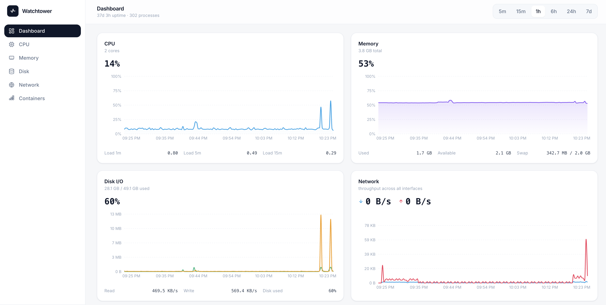
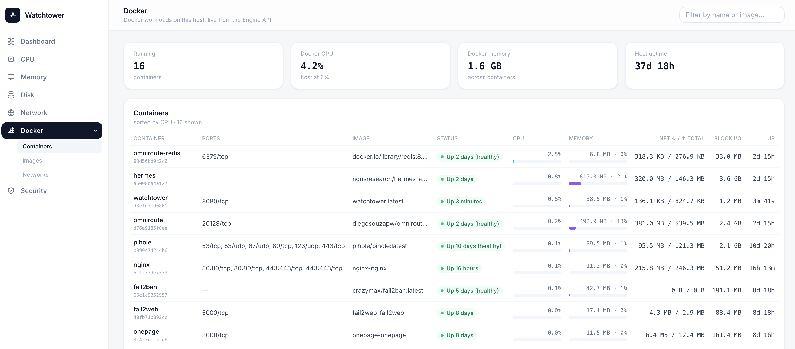

# Watchtower

A lightweight, self-hosted **VPS / server monitor** with a modern web UI.
Runs as a single Docker container on your server and reports the **host's**
CPU, memory, disk I/O, network throughput, uptime and process count — with
time-range selectors and live-updating charts.

  

<!-- Replace the images in docs/screenshots/ with your final captures. -->






## Features

- **Sidebar + drill-down pages** — Dashboard overview plus dedicated pages:
  **CPU** (per-core bars, user/system/iowait breakdown, top processes),
  **Memory** (used/buffers/cached breakdown, top processes by RSS),
  **Disk** (partitions, per-device I/O), **Network** (per-interface rates,
  link speed, IPs, errors/drops) and **Containers** (live per-container
  CPU %/mem %/net/block I/O from the Docker Engine API).
- **Host metrics** — reads the host's `/proc` & `/sys` (mounted read-only) so
  you monitor the VPS itself, not the container. Includes host network
  interfaces: per-NIC rates from `/proc/net/dev`, link state/speed/MTU from
  `/sys/class/net`, and real host IPs (a container's own network namespace
  would only ever show its Docker bridge IP).
- **Charts + time selectors** — 5m / 15m / 1h / 6h / 24h / 7d, with
  server-side downsampling so long ranges stay fast.
- **Live** — summary values refresh every 3s, charts every 10s, detail pages
  every 2–3s.
- **Auth** — single admin login, server-side sessions in SQLite, HttpOnly
  cookie with sliding expiry.
- **Tiny footprint** — one image (~180 MB), SQLite storage, 7-day retention.

## Quick start (Docker — on your server)

```bash
cp .env.example .env      # set WT_ADMIN_USER / WT_ADMIN_PASSWORD / WT_SECRET_KEY
# generate a secret:  openssl rand -hex 32
docker compose up -d --build
```

The app publishes **no host port** — `docker compose up` creates a
`watchtower.net` network, and the reverse proxy container joins it to reach
the app at `http://watchtower:8080`. See the next section.

### Running on a subdomain behind a reverse proxy (nginx container)

Join your nginx container to the network this stack creates — one-off:

```bash
docker network connect watchtower.net nginx
```

(or declare `watchtower.net` as `external: true` in nginx's own compose
file). Then set `WT_COOKIE_SECURE=true` in Doppler for an HTTPS-only session
cookie. Nothing else changes: the frontend uses relative `/api` URLs, so it
works on any hostname, and there are no redirects that depend on the Host
header.

In the nginx container's config, proxy straight to the service name:

```nginx
server {
    listen 443 ssl http2;
    server_name watchtower.example.com;
    # ssl_certificate ... / ssl_certificate_key ...

    location / {
        proxy_pass http://watchtower:8080;
        proxy_set_header Host $host;
        proxy_set_header X-Real-IP $remote_addr;
        proxy_set_header X-Forwarded-For $proxy_add_x_forwarded_for;
        proxy_set_header X-Forwarded-Proto $scheme;
    }
}
```

Since there is no published port, the firewall never sees 8080 — only the
proxy container is reachable, and it should be the one bound to `:80/:443`.

> **Standalone fallback:** if you ever run without the proxy, temporarily
> change `expose` back to a `ports:` mapping (`"127.0.0.1:8080:8080"`) and
> visit the server via an SSH tunnel.

## CI/CD — automatic deploy from GitHub Actions

Pushes to `main`/`master` deploy to the VPS via
[`isavage/deploy`](https://github.com/marketplace/actions/zero-config-vps-docker-deploy)
(workflow: `.github/workflows/deploy.yml`). Secrets are managed in
**Doppler**: the action installs the Doppler CLI on the VPS and runs
`doppler run -- docker compose up -d`, injecting variables in memory — no
`.env` file is ever written to disk.

**1. Doppler** — create a project and add these config variables:

| Doppler var         | Example                        |
| ------------------- | ------------------------------ |
| `WT_ADMIN_USER`     | `admin`                        |
| `WT_ADMIN_PASSWORD` | strong password                |
| `WT_SECRET_KEY`     | `openssl rand -hex 32` output  |
| `WT_COOKIE_SECURE`  | `true` behind TLS, else `false`|

Copy a **Service Token** (`dp.st.…`) for your production config.

**2. GitHub** — add repository secrets:

| Secret          | Purpose                                  |
| --------------- | ---------------------------------------- |
| `VPS_HOST`      | hostname/IP of the server                |
| `VPS_USER`      | SSH user (root or sudo-enabled)          |
| `VPS_SSH_KEY`   | private SSH key                          |
| `DOPPLER_TOKEN` | the `dp.st.…` service token              |

**3. Ship** — merge to `main`. The action rsyncs the repo to
`/docker/<repo>` on the VPS, builds the image there, brings the stack up, and
verifies the `watchtower` container is healthy (streaming logs on failure).
You can also trigger a deploy manually from the Actions tab, optionally with
`--no-cache`.


## Local development

```bash
# backend
python3.12 -m venv .venv && source .venv/bin/activate
pip install -r requirements.txt
python -m app.seed                                   # optional demo history
uvicorn app.main:app --reload --port 8080

# frontend (new terminal) — proxies /api to :8080
cd web && npm install && npm run dev                 # http://localhost:5173
```

To run the whole stack from one process, build the UI once and let FastAPI
serve it:

```bash
cd web && npm run build && cd ..
uvicorn app.main:app --port 8080                      # http://localhost:8080
```

Default dev login: `admin` / `demo1234` (set via env, never in production).

## Configuration (env vars)

| Variable             | Default                | Purpose                                   |
| -------------------- | ---------------------- | ----------------------------------------- |
| `WT_ADMIN_USER`      | `admin`                | Login username                            |
| `WT_ADMIN_PASSWORD`  | `changeme`             | Login password (change it!)               |
| `WT_SECRET_KEY`      | generated              | Set to a stable 32+ hex string in prod    |
| `WT_DB_PATH`         | `data/watchtower.db`   | SQLite location (a volume in Docker)      |
| `WT_HOST_ROOT`       | *(empty)*              | Host mount root, `/host` in Docker        |
| `WT_SAMPLE_INTERVAL` | `2`                    | Seconds between samples                   |
| `WT_SESSION_DAYS`    | `7`                    | Session sliding-expiry window             |
| `WT_COOKIE_SECURE`   | `false`                | Enable when served over HTTPS             |
| `WT_DOCKER_SOCKET`   | `/var/run/docker.sock` | Docker Engine API socket for Containers   |

## API

| Endpoint                | Method | Description                          |
| ----------------------- | ------ | ------------------------------------ |
| `/api/auth/login`       | POST   | `{username, password}` → sets cookie |
| `/api/auth/logout`      | POST   | Invalidates the session              |
| `/api/auth/me`          | GET    | Current user or 401                  |
| `/api/summary`          | GET    | Latest live values                   |
| `/api/details`          | GET    | Live drill-down: per-core CPU, memory breakdown, partitions, disk I/O, NIC rates, top processes |
| `/api/docker`           | GET    | Docker containers with live CPU/mem/net/blkio (`available: false` without the socket) |
| `/api/series?range=1h`  | GET    | Downsampled series for the range     |
| `/api/health`           | GET    | Liveness                             |

## Notes on host monitoring

`docker-compose.yml` mounts the host filesystem read-only and shares the host
PID namespace:

```yaml
pid: host
volumes:
  - /:/host:ro
  - /proc:/host/proc:ro
  - /sys:/host/sys:ro
```

With `WT_HOST_ROOT=/host`, every page reports the **server**, not the
watchtower container:

- **CPU / Memory / Disk / processes** — via psutil pointed at the host's
  `/proc` (`PROCFS_PATH`) and the shared PID namespace.
- **Network** — psutil's interface APIs are namespace-scoped ioctls, so they
  can't see the host from inside a container. The app parses the host's
  `/proc/net/dev`, `/sys/class/net/*`, `/proc/net/fib_trie`,
  `/proc/net/route` and `/proc/net/if_inet6` instead (see `app/hostnet.py`).
  Link speed shows `—` on virt/VPS NICs that don't report it.
- **Containers** — deliberately the exception: it queries the Docker Engine
  API over the mounted socket, so it shows per-container usage (which
  includes watchtower itself).

If your reverse proxy terminates TLS, forward the original scheme and set
`WT_COOKIE_SECURE=true` so the session cookie is only sent over HTTPS.

## License

MIT
